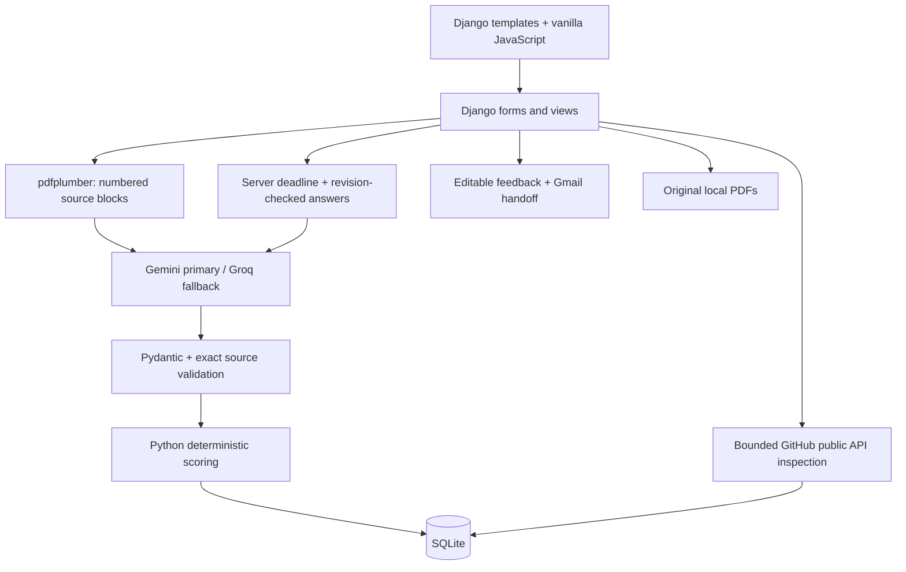
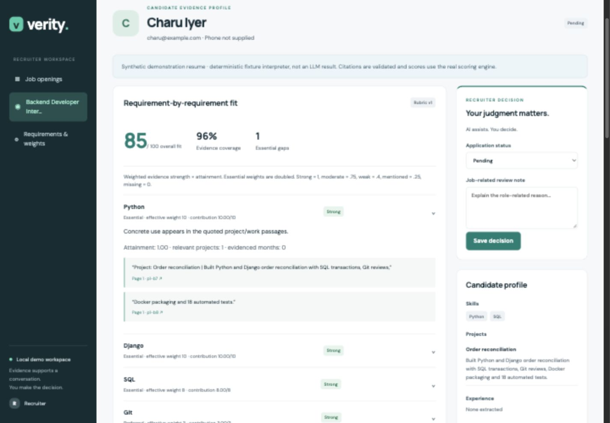

# Verity

**Don’t just find the best-written resume. Find the strongest evidenced candidate.**

Verity is a local, recruiter-led Django MVP for ALGOTHON’26 / ALG-AI-01. It compares multiple resumes with recruiter-approved job requirements, calculates transparent scores, and links each match to actual resume passages.

Resume statements are self-reported evidence. Public repository contents do not conclusively establish authorship or proficiency. Verity helps recruiters review evidence; it does not determine truth or make hiring decisions.

## Quick start

Python 3.11+ recommended; tested with Python 3.14 and Django 5.2.17.

```bash
python3 -m venv .venv
source .venv/bin/activate
pip install -r requirements.txt
cp .env.example .env
python manage.py migrate
python manage.py seed_demo
python manage.py runserver 127.0.0.1:8000
```

Open http://127.0.0.1:8000/ for the public landing page, or http://127.0.0.1:8000/dashboard/ for the recruiter workspace. No recruiter login is required for this localhost-only demo. Do not expose this development configuration to a public network.

`requirements-lock.txt` records the exact tested environment; `requirements.txt` provides compatible installation ranges. Keep `.env`, SQLite, and uploaded media out of version control.

### API configuration

Add keys to `.env` using your editor, never the browser or source code:

```dotenv
GEMINI_API_KEY=your_key
GROQ_API_KEY=your_key
GITHUB_TOKEN=optional_public_api_token
GEMINI_MODEL=gemini-2.5-flash
GROQ_MODEL=openai/gpt-oss-120b
```

Either LLM key is sufficient. Gemini is attempted first; Groq is the fallback. Each operation uses a maximum of two provider attempts, with 30-second SDK timeouts and no automatic SDK retries. Schema and evidence validation apply to both providers. Failed Gemini quota requests cause a brief cooldown. No completed analysis is silently replaced by a fallback model.

```bash
python manage.py check_providers
```

This makes a small structured-output request to each configured provider. Without keys it reports “not configured” and sends nothing. Provider account billing and quotas apply; the app does not activate billing or guarantee that a supplied key is on a free account.

## Demo data: honest offline mode versus live AI

`seed_demo` creates seven synthetic PDFs in `output/pdf/` and a clearly labelled fixture job. It extracts those real PDFs, interprets their deliberately structured content with a restricted rules-based fixture interpreter, validates citations through the same evidence engine, and computes scores using the actual scoring service. Scores are never hard-coded. **These fixtures are not LLM outputs or accuracy benchmarks.**

Normal uploads always use live AI. An AI outage does not silently trigger fixture analysis or fabricated scores; failed applications stay unranked.

```bash
# New, separately labelled job with genuine provider analysis:
python manage.py seed_demo --live

# At creation time, associate only your own or a consenting teammate's profile:
python manage.py seed_demo --github-profile https://github.com/YOUR_USERNAME
```

Existing jobs are preserved when rerunning the seed command. The GitHub option is used only when creating a new demo job. No real GitHub identity is associated by default. For an existing Farhan fixture, provide a new resume containing your consenting profile through the normal upload flow, or create the separate live demo with `--live --github-profile ...`.

| Candidate | Demonstration |
|---|---|
| Asha Rao | Two detailed relevant projects plus dated experience |
| Bharat Shah | Many skills listed, little implementation evidence |
| Charu Iyer | Concise profile with detailed backend project |
| Deepak Sen | Explicit Python evidence, missing essential Django |
| Esha Mehta | Three-year claim versus one year of visible dated evidence |
| Farhan Ali | Optional explicitly supplied consenting GitHub profile |
| Gita Nair | Same evidence as Asha and equal score, no GitHub penalty |

A few clearly synthetic interview answers entered during browser verification may be present in the current local database. Fresh installations start with ready candidates; interviews are created through candidate detail.

## Public landing page

The root route presents the product; `/dashboard/` preserves the operational recruiter overview. Existing job, application, and interview URLs are unchanged. Marketing candidate profiles, scores, interview playback, and feedback are labelled illustrative and never call providers or mutate application records. “Explore synthetic demo” appears only when a job contains `demo-fixture` applications.

The landing page has its own CSS and JavaScript. Motion **12.23.24** is pinned locally in `static/vendor/motion/`, with its MIT license; no npm install, build, or runtime CDN is needed. Google Fonts are optional and system fonts work offline. Content remains visible without JavaScript or Motion, and reduced-motion settings skip choreography. Interview/feedback playbacks finish on viewport exit or tab hiding and offer explicit replay.

Run the existing server command after pulling these changes; no migrations or additional dependencies are needed. The missing-provider notice can be dismissed for the current browser session. Synthetic job titles are simplified only for dashboard display and retain a visible synthetic-data badge.

## Features

- Job-description extraction and a recruiter-editable requirement rubric.
- Multiple text-PDF uploads, SHA-256 duplicate detection, sequential processing and resumable queues.
- Original PDF, raw extraction, numbered source blocks, structured data and provenance preserved.
- Deterministic weighted evidence scoring, category scores, essential gaps and candidate ranking.
- Name, score, skill/evidence, project-count, experience-months and decision filters.
- Citation-backed requirement and claim explanations.
- Cautious flags for explicit conflicting statements and visible duration evidence gaps.
- GitHub public API evidence, limited inspection, 24-hour persisted cache and neutral failure handling.
- Three-question, six-minute typed interview with server-owned deadlines, autosave revisions and original-answer review.
- Advisory AI interview analysis without an overall numeric interview score.
- Manual shortlist / hold / reject decisions.
- Constructive SWOT feedback, editable saved email, Gmail compose handoff and copy fallbacks.
- Clearly marked Digital Footprint Insights future-feature card; no social scraping or scoring.

## Architecture



One `recruitment` app, six models: Job, JobRequirement, Application, GitHubAnalysis, Interview, CandidateFeedback. Nested AI data uses JSONField. Independent update workflows have their own models. Business rules live in `recruitment/services/`, not templates.

The browser stores the upload batch first, then POSTs one processing request at a time. There is no background queue. Closing the page leaves remaining files queued; interrupted processing can be retried after 90 seconds. Processing failures do not stop the rest of the batch.

## AI usage

| Operation | Calls |
|---|---|
| JD requirements | One extraction call, recruiter approval required |
| Resume parsing + matching + claims | One combined structured call per application/rubric revision |
| Interview questions | One shared generation per job; standard scenarios on failure |
| Interview analysis | One call after submission, initiated by recruiter |
| Candidate feedback | One explicit generation; factual editable template on failure |
| GitHub | No LLM call; actual metadata, README and root-file signals |

All provider outputs are schema-validated. Resume quotes must exactly resolve to supplied blocks. Every requirement must appear exactly once. Strong/moderate evidence requires structured supporting passages. Skills-list-only evidence is capped at mentioned. Experience dates must have quoted support before precise month credit is awarded. Standard interview scenarios and fallback feedback are labelled, not passed off as AI-generated.

## Scoring

```text
strong = 1.0; moderate = 0.75; weak = 0.4; mentioned = 0.25; missing = 0
weight = recruiter importance × (2 if essential else 1)
match = evidence value × attainment
score = 100 × sum(weight × match) / sum(weight)
```

Attainment is 1 for ordinary requirements; minimum experience and project requirements use `min(evidenced amount / required amount, 1)`. Only direct moderate-or-strong project evidence counts toward project thresholds. Overlapping relevant employment intervals are unioned; year-only dates earn no invented month credit. Current-date calculations use the saved analysis date.

Repeated words do not accumulate points. Common aliases are normalized. Parent-technology inference is explicitly bounded: Django can support Python at moderate, for example. Java is never treated as JavaScript.

An essential match below .75 is flagged for review, not automatically rejected. GitHub, interview interpretation, and review flags never change the base resume score. Missing GitHub creates no penalty. “Evidence coverage” is requirement-weight coverage with direct moderate-or-strong citations, not a model confidence probability.

Weight changes recalculate scores immediately. Semantic requirement or JD changes increment the rubric revision and exclude stale results until reanalysis. Ranking uses unrounded score, then fewer essential gaps, then stable application ID.

## GitHub boundaries

Only resume-supplied GitHub URLs are used; the application never searches for identity. Repository URLs require recruiter confirmation of the owner. Requests go only to fixed `api.github.com` endpoints; redirects are not followed.

Inspect up to 30 owned repositories, choose up to three non-forks by requirement-term relevance and recency, and fetch languages, README, and root contents. Maximum about eleven requests per uncached inspection; no cloning, recursive traversal, commit analysis, or crawling. READMEs are capped at 8,000 characters. Cache for 24 hours, allow refresh, and respect reset headers on rate-limit failure. Stale cached evidence is retained with its timestamp.

“No additional evidence found” means only that the bounded inspection found none. It does not imply the skill is false.

## Interview behavior

Starting sets one immutable server deadline six minutes in the future. Refresh restores saved text and remaining time. One-second debounced saves plus periodic saves send the entire answer snapshot with a revision number. Conditional database updates prevent older snapshots overwriting newer ones. Submission is idempotent and locks responses; the inline confirmation requires a second click.

At expiry, the last snapshot received before the server deadline is final. Writes received after the deadline cannot change it. Disconnected/unsaved final text cannot be guaranteed to arrive; the instructions state that limit. Expiry finalizes on the next server request without a scheduler.

Original answers stay available even if AI analysis fails. Evaluation uses a question-specific advisory rubric and exact answer excerpts. It does not assess morality, mental health, protected characteristics, or scientific personality traits.

## Feedback and Gmail

Rejected status must be explicitly chosen by a recruiter. Feedback requires a job-related reason and current resume analysis. Interview findings are opt-in. Candidate-facing “Threats” are labelled “Role-specific challenges.” Missing evidence is not inability.

The recruiter edits and saves subject/body/recipient. Any unsaved edit disables Gmail handoff until saved. Compose values are URL-encoded; long drafts use copy controls. Gmail compose URLs are a browser convention, not a guaranteed API contract. Sign in to Gmail yourself and verify compose behavior in your intended browser. Verity never sends mail.

## Verification

```bash
python manage.py check
python manage.py test
node recruitment/tests/test_feedback_js.cjs
node recruitment/tests/test_landing_js.cjs
```

Focused automated tests cover score weighting, threshold attainment, interval union, aliases, parent caps, exact quotes, incomplete JSON, provider fallback, missing keys, invalid PDFs, duplicates, filtering, stale analyses, weight edits, GitHub cache/failure neutrality, interview refresh/deadline/revisions/submission, evaluation failures, decisions and feedback persistence.

Browser verification covers desktop/mobile layout, original-source views, interview start/autosave/refresh/expiry/submission and feedback editing. Live AI was unavailable during implementation because keys were absent. GitHub transport is tested with deterministic mocked API responses; a consenting real profile and Gmail sign-in remain user-dependent integration checks.

## Screenshots





## Judge walkthrough (5–7 minutes)

1. Explain the rubric and change one weight.
2. Compare Asha or Charu against keyword-heavy Bharat; open actual evidence excerpts.
3. Show Deepak's essential gap without automatic rejection.
4. Show Esha's visible-duration flag and both passages, stressing incomplete evidence.
5. Compare Asha and Gita: equal supplied evidence, no GitHub penalty.
6. If a consenting profile was supplied, inspect Farhan's public evidence; otherwise explicitly show the empty state.
7. Create/start a typed interview or review genuinely saved synthetic demo answers.
8. Make a manual decision, generate/edit/save feedback, and open Gmail or copy the saved draft.

For live AI demonstration, use a separately seeded `--live` job or upload one fresh PDF. Do not present rules-based fixtures as live provider results.

## Limitations and fairness

- Local, single-recruiter demo with no public access-control boundary. Candidate tokens are not production authentication.
- No OCR; text layout and semantic interpretation may be imperfect.
- Quote fidelity does not verify real-world truth. Models can still misinterpret a valid passage.
- An incomplete timeline is not proof of contradiction. All review flags require human review and never reduce scores directly.
- No protected-characteristic or school-prestige scoring, social analysis, autonomous rejection, or email sending.
- Strict literal skill grounding favors explicit descriptions; recruiters should review evidence gaps rather than treating them as lack of ability.
- Synthetic fixtures demonstrate behavior, not measured recruiting accuracy or predictive validity.
- Provider calls can still be slow or unavailable. SQLite/browser-driven processing is intended for small local batches.

Future work: DOCX/OCR, user access control, durable workers, more nuanced evidence review, candidate-consented professional links, and evaluated fairness/accuracy benchmarks. Social personality scoring is not planned.
