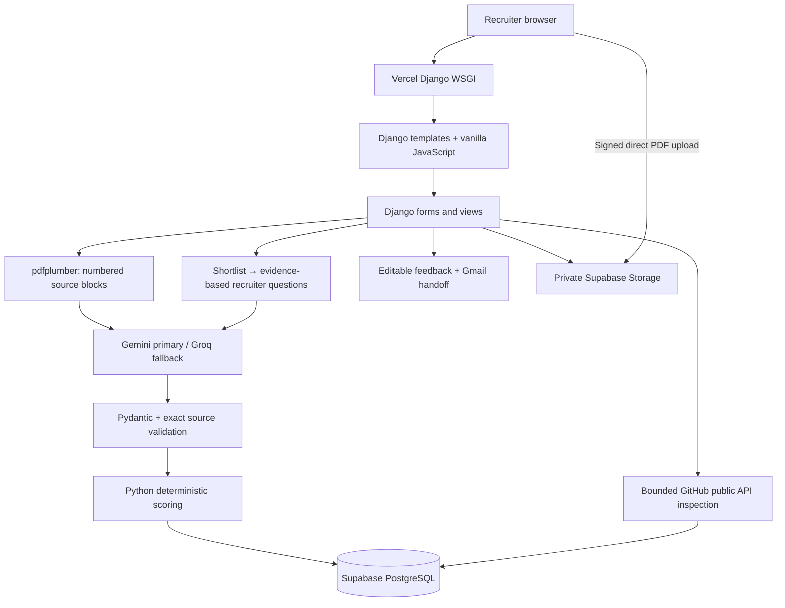
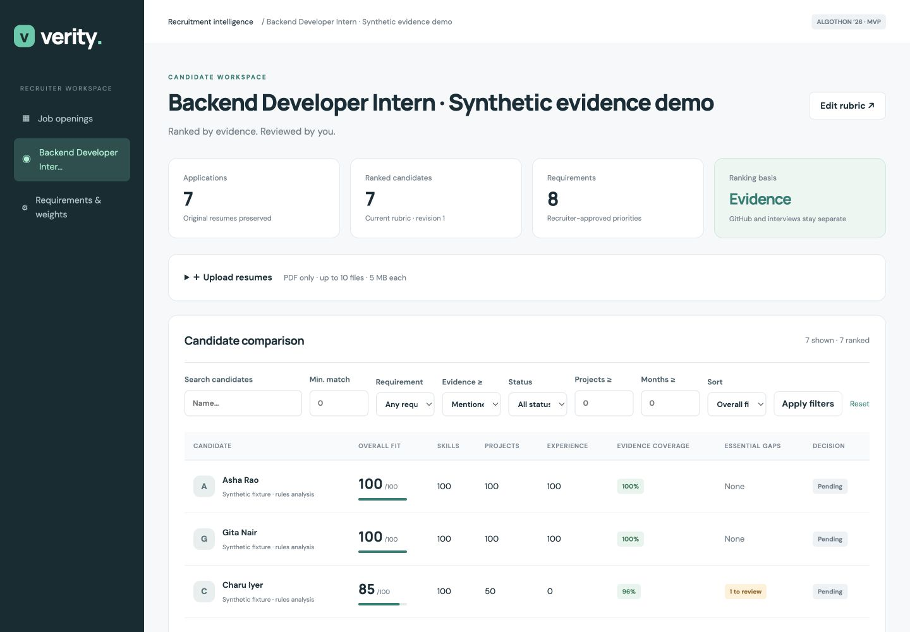
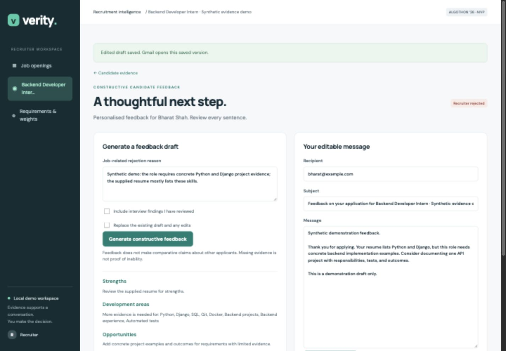

# Verity

**Don’t just find the best-written resume. Find the strongest evidenced candidate.**

Verity is a recruiter-led Django application built for **ALGOTHON’26 · ALG-AI-01: AI Resume & Job Matching System**. It compares multiple resumes with recruiter-approved job requirements, calculates transparent scores, and links each match to actual resume passages. The hosted application runs on **Vercel**, with **Supabase PostgreSQL** for persistent records and **private Supabase Storage** for PDFs. Local development keeps SQLite and local files by default.

Resume statements are self-reported evidence. Public repository contents do not conclusively establish authorship or proficiency. Verity helps recruiters review evidence; it does not determine truth or make hiring decisions.

## Live website

**[Open Verity](https://verity-iaomkilyv-mass-gethu.vercel.app/)** · **[Recruiter workspace](https://verity-ecru-omega.vercel.app/)**

The landing page introduces the product through clearly labelled illustrative examples. The recruiter workspace contains the actual job, upload, matching and review workflows. Enter the shared workspace password supplied privately by the project owner; credentials are not published here. Use synthetic resumes for the shared hackathon demo.

## Recruiter workflow

1. Create a job and submit its description to propose an editable requirement rubric.
2. Review essential/preferred requirements, weights and thresholds, then approve the rubric.
3. Upload up to ten text-based PDF resumes and process them sequentially.
4. Search, filter and compare candidates using rubric fit, evidence coverage and essential gaps.
5. Open the exact passages behind requirement matches and job-relevant claims; inspect optional supplied GitHub context.
6. Make a manual decision. Shortlisting prepares an editable six-question interview guide.
7. Conduct the interview through your usual process. For rejected applications, draft, edit and save constructive feedback before opening Gmail or copying the message.

**AI assists. Recruiters decide.** No automatic top-five cutoff, rejection, interview-answer evaluation or email sending.

## Technology stack

| Layer | Implementation |
|---|---|
| Backend | Django 5.2, Python; WSGI application hosted on Vercel |
| Frontend | Django templates, custom CSS, vanilla JavaScript |
| Hosted database | Supabase PostgreSQL through its transaction pooler |
| Hosted documents | Private Supabase Storage bucket with short-lived signed URLs |
| Local development | SQLite and local media files |
| Extraction and validation | pdfplumber, Pydantic, exact source-reference checks |
| AI | Gemini primary, Groq fallback; configurable model IDs |
| GitHub context | Bounded public REST API requests; no GitHub LLM call |
| Animation | Locally bundled Motion 12.23.24; reduced-motion support |

## Local quick start

Vercel uses Python **3.12**, pinned in `.python-version`. The local test environment uses Python 3.14 and Django 5.2.17.

```bash
python3 -m venv .venv
source .venv/bin/activate
pip install -r requirements.txt
cp .env.example .env
python manage.py migrate
python manage.py seed_demo
python manage.py runserver 127.0.0.1:8000
```

Open [the local landing page](http://127.0.0.1:8000/) or [the local recruiter workspace](http://127.0.0.1:8000/dashboard/). Local development does not require a workspace password by default. Hosted mode requires the shared workspace password. To exercise that access gate locally, set `VERITY_REQUIRE_JUDGE_ACCESS=1` and configure `VERITY_JUDGE_PASSWORD`.

`requirements-lock.txt` records the exact tested environment; `requirements.txt` provides compatible installation ranges. Keep `.env`, SQLite, and uploaded media out of version control.

### API configuration

Add keys to `.env` using your editor, never the browser or source code:

```dotenv
GEMINI_API_KEY=your_key
GROQ_API_KEY=your_key
GITHUB_TOKEN=optional_public_api_token
GEMINI_MODEL=gemini-2.5-flash
GROQ_MODEL=openai/gpt-oss-120b
```

Either LLM key is sufficient. Gemini is attempted first; Groq is the fallback. Each operation uses a maximum of two provider attempts, with 30-second SDK timeouts and no automatic SDK retries. Schema and evidence validation apply to both providers. Failed Gemini quota requests cause a brief cooldown. No completed analysis is silently replaced by a fallback model.

```bash
python manage.py check_providers
```

This makes a small structured-output request to each configured provider. Without keys it reports “not configured” and sends nothing. Provider account billing and quotas apply; the app does not activate billing or guarantee that a supplied key is on a free account.

## Demo data: honest offline mode versus live AI

`seed_demo` creates seven synthetic PDFs in `output/pdf/` and a clearly labelled fixture job. It extracts those real PDFs, interprets their deliberately structured content with a restricted rules-based fixture interpreter, validates citations through the same evidence engine, and computes scores using the actual scoring service. Scores are never hard-coded. **These fixtures are not LLM outputs or accuracy benchmarks.**

Normal uploads always use live AI. An AI outage does not silently trigger fixture analysis or fabricated scores; failed applications stay unranked.

```bash
# New, separately labelled job with genuine provider analysis:
python manage.py seed_demo --live

# At creation time, associate only your own or a consenting teammate's profile:
python manage.py seed_demo --github-profile https://github.com/YOUR_USERNAME
```

Existing jobs are preserved when rerunning the seed command. The GitHub option is used only when creating a new demo job. No real GitHub identity is associated by default. For an existing Farhan fixture, provide a new resume containing your consenting profile through the normal upload flow, or create the separate live demo with `--live --github-profile ...`.

| Candidate | Demonstration |
|---|---|
| Asha Rao | Two detailed relevant projects plus dated experience |
| Bharat Shah | Many skills listed, little implementation evidence |
| Charu Iyer | Concise profile with detailed backend project |
| Deepak Sen | Explicit Python evidence, missing essential Django |
| Esha Mehta | Three-year claim versus one year of visible dated evidence |
| Farhan Ali | Optional explicitly supplied consenting GitHub profile |
| Gita Nair | Same evidence as Asha and equal score, no GitHub penalty |

Migration 0003 retires the timed interview workflow and deletes its saved answers, evaluations and question cache. Jobs, applications, résumé evidence, recruiter decisions and saved feedback drafts are preserved. Existing shortlisted applications receive pending interview guides without provider calls during migration.

## Public landing page

The root route presents the product; `/dashboard/` preserves the operational recruiter overview. Existing job and application URLs are unchanged. Retired candidate-interview URLs return 404. Marketing candidate profiles, scores, interview-guide playback, and feedback are labelled illustrative and never call providers or mutate application records. “Explore synthetic demo” appears only when a job contains `demo-fixture` applications.

The landing page has its own CSS and JavaScript. Motion **12.23.24** is pinned locally in `static/vendor/motion/`, with its MIT license; no npm install, build, or runtime CDN is needed. Google Fonts are optional and system fonts work offline. Content remains visible without JavaScript or Motion, and reduced-motion settings skip choreography. Guide/feedback playbacks finish on viewport exit or tab hiding and offer explicit replay.

The recruiter dashboard shows actual job, application, pending-decision and ready-guide counts. The missing-provider notice can be dismissed for the current browser session. Synthetic job titles are simplified only for dashboard display and retain a visible synthetic-data badge. Candidate detail includes section navigation, linked essential gaps, expandable evidence and a collapsible interview guide.

## Features

- Job-description extraction and a recruiter-editable requirement rubric.
- Multiple text-PDF uploads, SHA-256 duplicate detection, sequential processing and resumable queues.
- Original PDF, raw extraction, numbered source blocks, structured data and provenance preserved.
- Deterministic weighted evidence scoring, category scores, essential gaps and candidate ranking.
- Name, score, skill/evidence, project-count, experience-months and decision filters.
- Citation-backed requirement and claim explanations.
- Cautious flags for explicit conflicting statements and visible duration evidence gaps.
- GitHub public API evidence, limited inspection, 24-hour persisted cache and neutral failure handling.
- Automatically prepared, editable six-question interview guides after recruiter shortlisting.
- Three source-linked profile prompts, one requirement clarification, and two consistent accountability/workplace scenarios.
- Recruiters conduct interviews themselves; no candidate portal, answer collection, character scoring or automated answer evaluation.
- Manual shortlist / hold / reject decisions.
- Constructive SWOT feedback, editable saved email, Gmail compose handoff and copy fallbacks.
- Clearly marked Digital Footprint Insights future-feature card; no social scraping or scoring.

## Architecture



One `recruitment` app, six models: Job, JobRequirement, Application, GitHubAnalysis, InterviewGuide, CandidateFeedback. Nested AI data uses JSONField. Independent update workflows have their own models. Business rules live in `recruitment/services/`, not templates.

Local mode substitutes SQLite and the local media directory for the hosted database and storage. Hosted uploads use signed URLs to upload directly to private storage, followed by a signed completion ticket that Django validates before accepting the application. The server checks actual PDF contents, size, extraction limits and duplicates; the browser never receives the storage service-role key.

Accepted PDFs are at most **5 MB**, **20 pages** and **50,000 extracted characters**, with at least 100 non-whitespace extracted characters. Image-only scans require OCR and are unsupported. SHA-256 prevents an identical file being uploaded twice within a job.

The browser uploads files and then POSTs one analysis request at a time. There is no background worker queue. Closing the page leaves remaining files queued; interrupted processing can be retried after 90 seconds. Processing failures do not stop the rest of the batch. Failed and stale applications have null scores and are excluded from current rankings.

## AI usage

| Operation | Calls |
|---|---|
| JD requirements | One extraction call, recruiter approval required |
| Resume parsing + matching + claims | One combined structured call per application/rubric revision |
| Interview guide | One personalised structured generation after shortlist; two server-owned shared scenarios; labelled templates on failure |
| Candidate feedback | One explicit generation; factual editable template on failure |
| GitHub | No LLM call; actual metadata, README and root-file signals |

All provider outputs are schema-validated. Resume quotes must exactly resolve to supplied blocks. Every requirement must appear exactly once. Strong/moderate evidence requires structured supporting passages. Skills-list-only evidence is capped at mentioned. Experience dates must have quoted support before precise month credit is awarded. Standard guide prompts, shared situational scenarios and fallback feedback are labelled, not passed off as AI-generated.

## Scoring

```text
strong = 1.0; moderate = 0.75; weak = 0.4; mentioned = 0.25; missing = 0
weight = recruiter importance × (2 if essential else 1)
match = evidence value × attainment
score = 100 × sum(weight × match) / sum(weight)
```

Attainment is 1 for ordinary requirements; minimum experience and project requirements use `min(evidenced amount / required amount, 1)`. Only direct moderate-or-strong project evidence counts toward project thresholds. Overlapping relevant employment intervals are unioned; year-only dates earn no invented month credit. Current-date calculations use the saved analysis date.

Repeated words do not accumulate points. Unrelated resume content adds no points and receives no automatic penalty. Common aliases are normalized. Parent-technology inference is explicitly bounded: Django can support Python at moderate, for example. Java is never treated as JavaScript.

An essential match below .75 is flagged for review, not automatically rejected. GitHub, interview guides, and review flags never change the base resume score. Missing GitHub creates no penalty. “Evidence coverage” is requirement-weight coverage with direct moderate-or-strong citations, not a model confidence probability.

Weight changes recalculate scores immediately. Semantic requirement or JD changes increment the rubric revision and exclude stale results until reanalysis. Ranking uses unrounded score, then fewer essential gaps, then stable application ID.

## GitHub boundaries

Only resume-supplied GitHub URLs are used; the application never searches for identity. Repository URLs require recruiter confirmation of the owner. Requests go only to fixed `api.github.com` endpoints; redirects are not followed.

Inspect up to 30 owned repositories, choose up to three non-forks by requirement-term relevance and recency, and fetch languages, README, and root contents. Maximum about eleven requests per uncached inspection; no cloning, recursive traversal, commit analysis, or crawling. READMEs are capped at 8,000 characters. Cache for 24 hours, allow refresh, and respect reset headers on rate-limit failure. Stale cached evidence is retained with its timestamp.

“No additional evidence found” means only that the bounded inspection found none. It does not imply the skill is false.

## Evidence-based Interview Guide

Shortlisting saves the recruiter’s decision immediately and creates a pending guide. Candidate detail automatically POSTs guide preparation once current résumé analysis and approved requirements are available. Without JavaScript, the recruiter uses **Prepare interview guide**. The shortlist decision never depends on provider availability.

Each saved guide contains three profile-specific questions, one evidence-gap clarification and two standard workplace scenarios about accountability and competing commitments. Profile prompts cite actual supplied passages; clarification links the relevant requirement. Each includes its purpose and an optional follow-up. The recruiter edits, saves and copies the guide, then conducts the interview through their normal process.

One provider operation prepares the four personalised prompts. Only relevant quoted evidence and approved job requirements are supplied; contact details and social links are excluded. Source references, requirement IDs and the question mix are validated. Named/quantified premises are checked against supporting text, but exact citation fidelity still cannot guarantee perfect semantic interpretation; recruiters review every prompt. Failure produces a clearly labelled evidence-based template, not simulated AI output. A candidate with little supplied evidence receives neutral prompts, not invented experience.

Repeated shortlisting reuses saved questions and edits. Changes to job title, description, requirements or relevant evidence mark the guide outdated and require explicit regeneration. Regeneration has a replacement confirmation. Revision checks protect edits across tabs, and a 90-second generation lease prevents competing requests; superseded or changed-context outputs cannot overwrite newer results. Preparation can be retried after an interruption.

The new POST routes are `/applications/<id>/interview-guide/generate/` and `/applications/<id>/interview-guide/save/`. There are no candidate links, timers, answer storage, interview ratings, values scores or interview-performance filters. Situational questions explore workplace actions and reasoning; they do not establish personal character or private beliefs.

The guide can be collapsed within candidate detail. Editing does not alter resume scores, and changing decision status preserves the saved questions.

## Feedback and Gmail

Rejected status must be explicitly chosen by a recruiter. Feedback requires a job-related reason and current resume analysis. Interview-guide questions are never treated as candidate answers or included as evaluated interview findings. Recruiters can supply factual job-related reasons from their own review. Candidate-facing “Threats” are labelled “Role-specific challenges.” Missing evidence is not inability.

The recruiter edits and saves subject/body/recipient. Any unsaved edit disables Gmail handoff until saved. Compose values are URL-encoded; long drafts use copy controls. Gmail compose URLs are a browser convention, not a guaranteed API contract. Sign in to Gmail yourself and verify compose behavior in your intended browser. Verity never sends mail.

## Verification

```bash
python manage.py check
python manage.py test
python manage.py makemigrations --check --dry-run
node recruitment/tests/test_feedback_js.cjs
node recruitment/tests/test_landing_js.cjs
node recruitment/tests/test_interview_guide_js.cjs
node recruitment/tests/test_cloud_upload_js.cjs
# Requires the hosted environment variables, without changing local defaults:
VERITY_PRODUCTION=1 python manage.py check --deploy
```

Focused automated tests cover score weighting, threshold attainment, interval union, aliases, parent caps, exact quotes, incomplete JSON, provider fallback, missing keys, invalid PDFs, duplicates, filtering, stale analyses, weight edits, GitHub cache/failure neutrality, guide grounding, shortlist preparation, edit revisions, stale inputs, concurrent generation, provider fallback and retired-route/migration checks, decisions and feedback persistence.

The latest local verification passed **71 Django tests**, Django system checks, production deployment checks and migration-drift checks. Tests include hosted upload tickets, private PDF access and the workspace access gate. These are regression checks, not a measured recruiting-accuracy benchmark.

An evidence-association accuracy fix accepts an exact shorter excerpt inside a supporting passage from the same block, while rejecting disjoint text, invented quotes and matching block IDs without passage containment. See [the accuracy review](docs/accuracy-review.md).

Browser review covers desktop/mobile layout, original-source views, guide editing/saving/copying, collapsible panels and illustrative playback. Provider credentials are now configurable in both local and hosted environments; successful access still depends on model permissions, quotas and valid output. GitHub automated tests use mocked API responses. Rehearse live provider processing, a consenting GitHub profile and Gmail in the deployed browser; a successful build or `/health/` response alone does not verify those integrations.

## Screenshots






## Judge walkthrough (5–7 minutes)

1. Explain the rubric and change one weight.
2. Compare Asha or Charu against keyword-heavy Bharat; open actual evidence excerpts.
3. Show Deepak's essential gap without automatic rejection.
4. Show Esha's visible-duration flag and both passages, stressing incomplete evidence.
5. Compare Asha and Gita: equal supplied evidence, no GitHub penalty.
6. If a consenting profile was supplied, inspect Farhan's public evidence; otherwise explicitly show the empty state.
7. Shortlist a candidate, show the automatically prepared guide, inspect a cited passage, and edit/save a follow-up. Explain the two shared accountability/workplace scenarios.
8. Make a manual decision, generate/edit/save feedback, and open Gmail or copy the saved draft.

For live AI demonstration, use a separately seeded `--live` job or upload one fresh PDF. Do not present rules-based fixtures as live provider results.

## Limitations and fairness

- Hosted hackathon demo with a shared password-protected recruiter workspace; no individual accounts, organisation isolation or full production authentication. The interview guide is recruiter-facing; there is no candidate access flow.
- No OCR; text layout and semantic interpretation may be imperfect.
- Quote fidelity does not verify real-world truth. Models can still misinterpret a valid passage.
- An incomplete timeline is not proof of contradiction. All review flags require human review and never reduce scores directly.
- No protected-characteristic or school-prestige scoring, social analysis, autonomous rejection, or email sending.
- Strict literal skill grounding favors explicit descriptions; recruiters should review evidence gaps rather than treating them as lack of ability.
- Synthetic fixtures demonstrate behavior, not measured recruiting accuracy or predictive validity.
- Provider calls can still be slow or unavailable. Browser-driven sequential processing is intended for small batches, even with hosted PostgreSQL.
- Hosted uploads require JavaScript. Files rejected after direct storage upload can leave orphaned objects; clean up unreferenced objects after the demo.

Future work: DOCX/OCR, individual accounts and access controls, durable workers, more nuanced evidence review, candidate-consented professional links, and evaluated fairness/accuracy benchmarks. Social personality scoring is not planned.

## Public hackathon deployment

The hosted application uses Vercel's Django integration, Supabase PostgreSQL and a private `resumes` bucket. See [deployment instructions](docs/deployment.md) for the complete setup and live rehearsal checklist.

Required hosted settings are `DATABASE_URL`, `SUPABASE_URL`, `SUPABASE_SERVICE_ROLE_KEY`, `SUPABASE_STORAGE_BUCKET`, `DJANGO_SECRET_KEY` and `VERITY_JUDGE_PASSWORD`, plus at least one AI provider key for live analysis. Configure the canonical hostname and HTTPS origin through `DJANGO_ALLOWED_HOSTS` and `DJANGO_CSRF_TRUSTED_ORIGINS`. `SUPABASE_URL` must be the project API origin, not a dashboard URL. URL-encode reserved characters in the database password. Keep all credentials out of Git and the README.

Vercel enables production mode automatically. Local development keeps SQLite unless `VERITY_USE_SUPABASE=1` is set. Migrations run explicitly against the cloud database, not on every request; laptop records are not automatically transferred. Seed the hosted database separately if synthetic examples are needed.

The public landing page remains open. Recruiter routes require the shared workspace password, supplied privately to judges. Production disables debug mode and uses secure signed session cookies. PDF views authorise access before redirecting to a five-minute signed storage URL. The WSGI function is configured for a 120-second duration; confirm the deployment account supports it.

Verify login, live synthetic upload/analysis, evidence links, guide edits, GitHub and feedback, then confirm records and PDFs survive a redeployment. The health endpoint reports application availability; it is not a database or provider smoke test.
