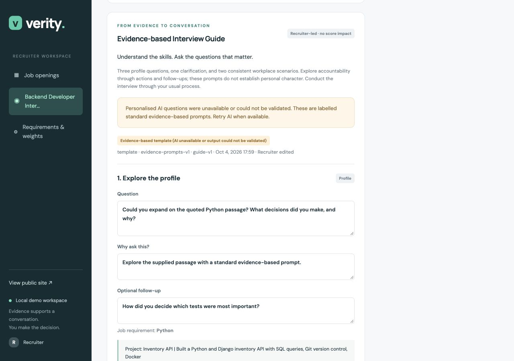
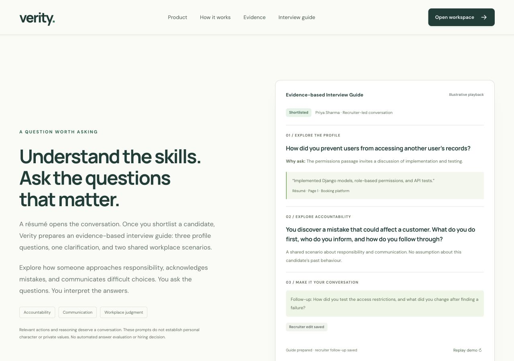

# Evidence-based Interview Guide implementation

Shortlisting now saves the recruiter decision immediately, then opens the candidate’s interview-guide panel. A CSRF-protected browser POST prepares six saved questions: three profile prompts, one requirement clarification and two consistent workplace scenarios. Recruiters edit, save and copy the questions, and conduct interviews through their usual process. Résumé scores and ranking are unchanged.

Migration 0003 has been applied to the local database. It deletes the old Interview table, including answer/evaluation records, and removes the job question cache. It preserves jobs, applications, evidence, decisions and feedback drafts; existing shortlisted applications receive pending guides without calling providers. Historical migrations remain intact. Retired candidate-token, answer and evaluation routes return 404.

## Generation and reliability

The existing Gemini/Groq adapter handles one structured operation for the four personalised questions, with at most two provider attempts. Only approved job requirements and relevant, validated résumé passages enter the payload; candidate contacts and supplied social links are excluded. Exact citations, IDs, question mix, linked requirements and named/quantified premises are validated. Semantic truth cannot be proved by citation checks: recruiters still review question wording and the underlying self-reported evidence.

Two server-owned scenarios explore mistakes and competing commitments. They are identical across candidates and contain no résumé citations or conclusions about character. On provider failure, the application creates explicitly labelled standard evidence-based template prompts, with an explicit AI retry. If no relevant citations exist, neutral prompts explain the limited evidence instead of fabricating a profile premise.

A 90-second compare-and-set generation lease prevents competing tabs from saving different results. Interrupted preparation can be retried after the lease expires. Results are discarded if the relevant analysis or requirements change during generation. Saved guides carry a context fingerprint, provenance and revision. Edits require the current revision; outdated guides remain visible with a warning and require explicit regeneration. Regeneration requires a replace checkbox and warns about unsaved edits.

Feedback no longer accepts interview evaluation inputs. Guide questions are never treated as answers or evidence of workplace behaviour.

## Product presentation

The dashboard counts ready guides. Candidate detail owns the guide editor and supporting source disclosures. The public landing page prominently presents “Understand the skills. Ask the questions that matter.” Its illustrative playback shows shortlist, profile question, supporting passage, shared scenario and recruiter edit. It creates no application records or provider requests. Existing local Motion integration, reduced-motion completion states and offscreen cleanup remain in place.

## Verification

- 56 Django tests passed, including migration deletion/preservation, shortlist preparation, provider/template validation, edit conflicts, generation leases, stale inputs, feedback exclusion and retired-route 404 checks.
- Django system check passed; `makemigrations --check --dry-run` reports no drift.
- Landing JavaScript checks passed: ranking/menu, missing Motion, reduced-motion changes, replay and offscreen cleanup.
- Guide JavaScript checks passed: automatic CSRF POST, save conflict preservation, revision update, copied citations and regeneration protection.
- Existing Gmail encoding/unsaved draft/oversized fallback checks passed.
- Browser: synthetic Asha was shortlisted; automatic preparation produced a labelled template, preserving 100/100 résumé fit. A follow-up edit survived save and reload. Copy succeeded and a résumé link opened the source disclosure. No console errors were observed.
- Landing had no horizontal overflow at 375, 768, 1280 and 1440 pixels; candidate guide checked at 375 and 1280. Mobile menu state and Escape dismissal worked. Desktop/mobile screenshots were refreshed.

Live provider access was unavailable in this environment, so the real-browser generation check exercised the honest template path. Provider success/fallback contracts are covered by mocked tests. Reduced motion and unavailable Motion were checked with the JavaScript harness; OS preference toggling and JavaScript-disabled browsing were not separately exercised in this browser session. Plain forms, visible static content and workspace links remain available without JavaScript.

## Changed files

Created:

- `recruitment/services/interview_guide_service.py`
- `recruitment/migrations/0003_remove_job_question_set_interviewguide_and_more.py`
- `recruitment/tests/test_interview_guide.py`
- `recruitment/tests/test_interview_guide_js.cjs`
- `templates/recruitment/interview_guide.html`
- `static/js/interview_guide.js`
- this report and `docs/screenshots/interview-guide.jpg`, `docs/screenshots/landing-interview-guide.jpg`, `docs/screenshots/interview-guide-mobile.jpg`

Modified:

- `recruitment/models.py`, `schemas.py`, `views.py`, `urls.py`
- `recruitment/services/ai_service.py`, `feedback_service.py`, `providers.py`
- `recruitment/tests/test_core.py`, `test_landing.py`, `test_landing_js.cjs`
- `templates/base.html`, `templates/recruitment/detail.html`, `feedback.html`, `home.html`, `landing.html`, `workspace.html`
- `static/css/app.css`, `landing.css`, `static/js/landing.js`
- `README.md`, `docs/landing-redesign.md`
- refreshed `docs/screenshots/landing-full.jpg`, `landing-mobile-full.jpg`, `workspace-redesign.jpg`

Deleted:

- `recruitment/services/interview_service.py`
- `templates/recruitment/interview.html`
- `static/js/interview.js`

## Local commands

```sh
.venv/bin/python manage.py migrate
.venv/bin/python manage.py runserver 127.0.0.1:8000
.venv/bin/python manage.py test
.venv/bin/python manage.py check
.venv/bin/python manage.py makemigrations --check --dry-run
node recruitment/tests/test_interview_guide_js.cjs
node recruitment/tests/test_landing_js.cjs
node recruitment/tests/test_feedback_js.cjs
```




